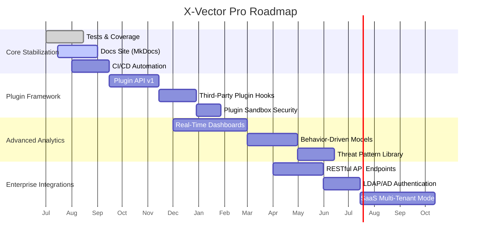

# Roadmap

This document outlines the planned evolution of **X-Vector Pro** from core stabilizations through advanced analytics and enterprise integrations. Milestones are grouped into near-term (next 3 months), mid-term (3–9 months), and long-term (9+ months) phases.

---

## Gantt Timeline



---

## Near-Term (0–3 months)

- Finalize comprehensive unit & integration test suite (target ≥ 80% coverage)  
- Launch official MkDocs site with usage, architecture, and developer pages  
- Implement CI/CD pipelines (lint, tests, docs build, package release)  
- Harden existing exploit modules; sweep `cve_db.json` for new entries  
- Add basic plugin registration API (discover & enable modules at runtime)

---

## Mid-Term (3–9 months)

- Design and expose a stable **Plugin Framework**:  
  - Define plugin lifecycle hooks (init, before_scan, after_exploit)  
  - Support community-developed plugins via PyPI or Git repositories  
- Sandbox plugin execution for safety (e.g., `multiprocessing` isolation)  
- Develop a **Wizard UI** for guided exploit creation (templates, field validation)  
- Enhance telemetry ingestion with real-time streaming (Kafka, Syslog, STDIN)  
- Integrate Prometheus metrics and Grafana dashboards for live monitoring

---

## Long-Term (9+ months)

- Build **Advanced Analytics** features:  
  - Behavior-driven ML models for anomaly detection  
  - Threat pattern marketplace and sharing portal  
- Expose **RESTful API** for headless operation and 3rd-party integrations  
- Add enterprise features:  
  - LDAP/Active Directory authentication & role-based access control  
  - Multi-tenant SaaS deployment mode  
- Explore **Cloud-Native** deployment (Docker, Helm charts, Kubernetes)
- Incorporate **Threat Intelligence Feeds** (MISP, OpenCTI)

---

## Contributing to the Roadmap

We welcome feedback and pull requests! To propose a new feature or improvement:

1. Open an issue in the GitHub repo labelled `roadmap`.  
2. Discuss design and implementation details with maintainers.  
3. Submit a PR against a new feature branch, including tests and docs updates.  

Your contributions drive X-Vector Pro’s evolution—thank you!  
```
